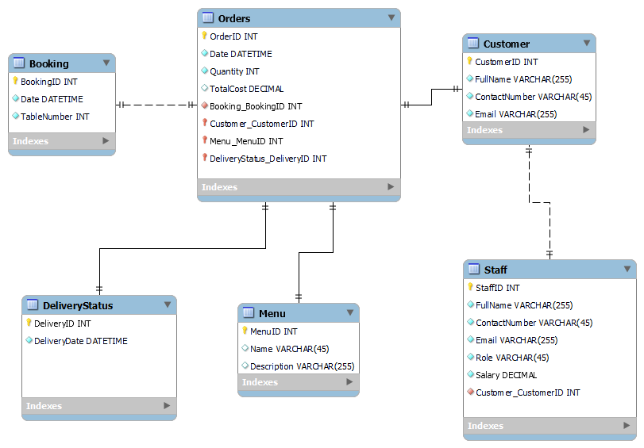

# 🧾 Little Lemon – Booking System & SQL Capstone

**Little Lemon Booking System** is a database-driven project focused on simulating restaurant operations, including reservations, orders, and sales analysis. The project showcases **SQL querying**, **stored procedures**, **data modeling**, and **interactive dashboards** using Jupyter Notebooks and structured datasets.

---

## 🧱 Project Overview

| Area            | Tools / Technologies         |
|-----------------|------------------------------|
| DBMS            | MySQL                        |
| SQL Tasks       | Queries, Views, Procedures   |
| Visualization   | Matplotlib, Seaborn          |
| Notebook Env    | Jupyter (Python 3)           |
| Diagram Design  | MySQL Workbench              |
| Dataset Format  | CSV, XLSX                    |

---

## 📁 Directory Structure

```
LittleLemon-BookingSystem/
├── Data/                      # Source datasets
│   ├── LittleLemondata.csv
│   ├── modified.csv
│   └── LittleLemon_data.xlsx
├── Diagrams/                 # ER diagrams & database models
│   ├── LittleLemonDM.mwb
│   ├── Project.mwb
│   └── LittleLemonDM.png
├── Notebooks/                # Jupyter notebooks for data analysis
│   ├── Database Engineer Capstone.ipynb
│   └── Create interactive dashboard for sales and profits.ipynb
├── SQL/                      # All SQL queries and tasks
│   ├── LittleLemonDB.sql
│   ├── AddBooking Task 1.sql
│   ├── SP Task 1.sql
│   └── ...
├── Visualizations/           # Graphs and charts generated
│   ├── Profit chart Task 2.png
│   ├── Cuisine Sales and Profits Task 4.png
│   └── ...
├── LICENSE
└── README.md
```

---

## 🗃️ SQL Coverage

This project includes:

- ✅ Table creation and schema design (`LittleLemonDB.sql`)
- ✅ Joins, views, aggregate queries (`JOIN clause Task 2.sql`, `OrdersView Table Task 1.sql`)
- ✅ Stored procedures (`SP Task 1.sql`, `SP Task 2.sql`)
- ✅ Data validation logic (`AddValidBooking Task 3.sql`)
- ✅ Booking, order, and cancellation management
- ✅ Subqueries, variables, and transactions

---

## 📊 Data Visualization & Analysis

Using Python notebooks to explore:

- 📈 Sales and profit trends  
- 🍝 Top cuisines by revenue  
- 👤 Customer order behavior  
- 📊 Interactive dashboards using charts

Visuals exported to `Visualizations/` directory as PNGs and JPGs.

---

## 🗂️ Entity-Relationship Diagrams

- Designed using **MySQL Workbench**
- Available as `.mwb`, `.bak`, and `.png` files
- Shows table relations for orders, customers, bookings, and menu items

Example:  


---

## 🚀 Getting Started

1. Clone the repository
2. Open `.sql` files in **MySQL Workbench** or import `LittleLemonDB.sql`
3. Launch `.ipynb` notebooks in **Jupyter Lab** or VS Code
4. Run visualizations from `Notebooks/` and explore charts

---

## 📬 Author

I'm Ongun Akay, a Senior Full-Stack Developer with expertise across various technologies.

About Me:  
👀 I specialize in full-stack development with extensive experience in frontend and backend technologies. 🌱 Currently, I'm sharpening my skills in advanced concepts of web development. 💞️ I’m always open to exciting collaborations and projects that challenge my abilities. 
📫 Contact: [info@ongunakay.com](mailto:info@ongunakay.com)

---

## 📄 License

MIT License – See [`LICENSE`](./LICENSE)
